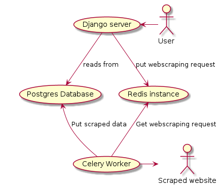

# Pieski-UW
Live demo is available at: https://pieski.arturkamieniecki.pl


## Getting Started
Live demo is being prepared and will be available in the future.  
To run this project localy:
```bash
git clone https://github.com/Pieski-Uw/Pieski-UW.git
cd Pieski-UW
docker compose up --build
```
Subsequent runs to not require `--build` flag, which rebuilds docker images if need be.  
Locally deployed website should be available at `127.0.0.1:8000` 

## Project structure
Application consists of 2 main components:
- UI / data visualization
- backend webscraper with data from [Warsaw animal shelter website](https://napaluchu.waw.pl/zwierzeta/znalazly-dom/)

While running default `docker compose` configuration, service roughtly follows below architecture:  


## Deployment
In order to start all docker containers with default configuration run and detached console
```bash
docker compose up -d
```
In order to shutdown whole application use
```bash
docker compose down
```
Configuration is achieved via modifying enviroment variables, default values are specified in [`.env`](.env) file  
In order to change default values ex. postgresDB
```bash
export DJANGO_PUBLIC_PORT=80
export POSTGRES_USER=pieskiUW
export POSTGRES_PASSWORD=********
export POSTGRES_DB=pieskiUW_db
docker compose up -d
```

Because of docker's modular structure exchanging docker postgres instance for another one can be achieved by modyfying enviroment variables and [`docker-compose.yml`](docker-compose.yml) file. 

## Tests
Tests are run using `pytest` framework.  
In order to run tests locally:  
```bash
pip install -r requirements.txt
pytest django
```

## Database
Scraped data is hosted on actively private db.
Database uptime can be checked at this address:  
[https://kuma.arturkamieniecki.pl/status/pieskiuw](https://kuma.arturkamieniecki.pl/status/pieskiuw)


## Deployment without docker
The webscraper application uses threads not to halt the main django process.   
Because it uses them to update the database `redis` instance is needed.
Redis server needs to be installed and running on the machine.  
If run on ubuntu the redis server can be installed using:
```bash
sudo apt install redis-server
```
Similarly to docker deployment, the database needs to be configured.

Afterwards, the django application can be run using:
```bash
python manage.py runserver
```
The webscraper can be run using:
```bash
celery -A pieskiUW worker --loglevel=info --concurrency 1 -E
```
